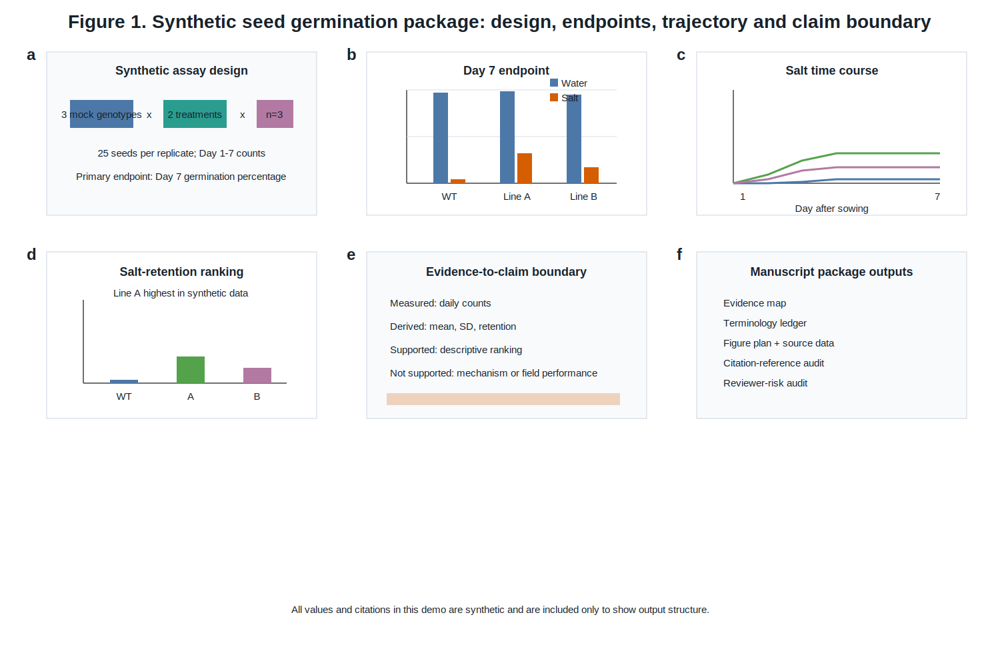

# A synthetic seed-germination dataset demonstrates a figure-led manuscript-building workflow

## Abstract

Manuscript-building workflows for experimental biology need to convert heterogeneous materials into a coherent research article without losing the connection between claims, figures, citations and source data. This is difficult to test safely with unpublished projects because real drafts may contain private data, author information, unverified references or confidential results. Here, we present a fully synthetic seed-germination demo that illustrates the expected output of the `research-paper-builder` skill at manuscript scale rather than report scale. The demo uses a fictional dataset with three mock plant genotypes, two treatments and three biological replicates per genotype-treatment combination. Water-treated seeds reached high Day 7 germination across genotypes, with means from 94.7% to 98.7%. Salt treatment reduced Day 7 germination in every mock genotype, but the synthetic Mock-Line-A group retained the highest salt-treated germination at 32.0%, compared with 17.3% for Mock-Line-B and 4.0% for Mock-WT. These values support only a descriptive ranking within the fictional dataset; they do not support mechanism, real genotype recommendation or field performance. The package demonstrates the manuscript components that should be produced for a real project: literature-intake status, evidence map, terminology ledger, integrated multi-panel figure, source data, figure-led Results, approximately 1,200-word background section, citation-reference audit, Data Availability statement, reviewer-risk audit and package manifest. This demo therefore defines the expected form of a traceable manuscript package while avoiding exposure of private research materials.

## Introduction

Scientific manuscripts are not only polished text; they are evidence systems in which data, figures, claims, citations and limitations must remain synchronized. A manuscript can read fluently while still failing because the title overstates the evidence, the Introduction cites claims that are absent from the reference list, the Results describe stale figure values, or the Discussion implies a mechanism that was never tested. These failures are especially common when writing begins from a draft or a set of plots rather than from a structured evidence map [R01,R13]. For this reason, a manuscript-building workflow needs to start before prose generation. It should first define the target article type, journal expectations, evidence boundary, terminology ledger, figure sequence and literature-intake status. Only after those elements are clear should it produce a full Abstract, Introduction, Results, Discussion and submission-support package [R11,R12,R14].

The need for a disciplined workflow is clearest in plant-stress and seed-germination studies, where small differences in wording can change the implied strength of the scientific claim. Seed germination is a developmental transition influenced by dormancy status, hormonal signaling, water availability, temperature, maternal environment and genotype [R01,R02]. In real plant biology, abscisic acid, gibberellins and multiple environmental cues interact to regulate whether seeds remain dormant, initiate germination or establish seedlings [R02,R03]. Stress treatments can further complicate interpretation because reduced germination can reflect osmotic inhibition, ion toxicity, delayed emergence, seed-lot quality or assay-specific conditions rather than a single tolerance mechanism [R04,R05]. A manuscript that reports a germination assay must therefore avoid turning a descriptive treatment response into an unsupported mechanism claim.

Salt-treatment examples are useful for workflow demonstration because the experimental structure is compact but still exposes common manuscript risks. A simple dataset may contain genotypes, treatments, replicates, daily counts and endpoint percentages. From those values, authors can calculate mean germination, variation among replicates and a retention metric comparing stress treatment with control treatment [R08,R09]. However, the same dataset rarely explains why one line retains more germination than another. Without physiological assays, ion measurements, hormone quantification, transcript profiling or genetic validation, the result should be framed as a descriptive screen or candidate prioritization rather than as proof of salt tolerance [R04,R05,R18]. This distinction is central to claim calibration and reviewer-risk reduction.

Genotype-by-treatment comparisons also need careful background framing because natural variation can be valuable without being mechanistically resolved. In real studies, differences among accessions, mutant lines or breeding materials may nominate candidate material for follow-up, but a ranking alone does not establish the causal allele, pathway or agronomic utility [R06,R07]. Quantitative traits such as germination percentage and stress emergence are often affected by seed-lot history, maternal environment, dormancy state, experimental timing and scoring criteria [R06,R08]. A manuscript should therefore distinguish three levels of inference: observed variation in the assay, candidate prioritization from the assay, and validated biological explanation. The present demo models that distinction by allowing a descriptive ranking while blocking language that would imply real tolerance or mechanism [R07,R17].

A second reason to use a germination example is that it demonstrates figure-led Results writing. In a full manuscript, the Results section should not be a list of values detached from figures. Each main figure should answer a result question and connect panels to source data, statistics and captions [R10,R11,R12]. For a germination study, an integrated figure might combine the assay design, endpoint comparison, time-course trajectory, retention ranking and claim boundary. The text should then guide the reader through each panel: what was measured, which comparison is shown, what pattern is supported, and what the pattern does not prove. This figure-led structure prevents a short report style in which the manuscript says "the data are shown" without explaining how the evidence supports the central argument [R11,R13].

The literature background also requires more depth than a short demonstration report. A real manuscript would need a structured literature intake before writing, including documented searching, full-text learning of the relevant papers, and extraction of common methods, figures, terminology and claim limits [R13,R14]. For high-ambition manuscripts, the skill now treats a 200-paper full-text reading matrix as the default gate before polished writing. That matrix should record full-text status, reading depth, relevance tier, figure lessons, method precedents, limitations and citation role. If that gate is incomplete, the correct output is a literature plan and outline rather than a final manuscript. The present demo does not claim to satisfy that requirement. Instead, it includes a synthetic citation set to show how an Introduction can maintain citation-reference consistency without exposing or inventing real literature [R16].

Citation integrity is a separate deliverable, not a final cosmetic pass. Every in-text citation should map to a reference-list entry, and every reference-list entry should be cited at least once [R16]. Citation roles also matter. Some references support broad background, some support methodology, some support limitations, and some support interpretation. If a paper is used only as a style model, it should not be cited unless it also supports a scientific statement. The demo therefore includes a `citation_reference_audit.csv` file that records each citation key, where it first appears and what role it plays. This mirrors the kind of audit needed in real manuscripts, where unmatched references, uncited bibliography entries and memory-based citations can create submission errors or research-integrity risks [R12,R16].

Terminology control is another major reason to use a package-based workflow. Genotype labels, treatments, traits, abbreviations and endpoints often change between analysis files, figure labels and prose. Without a terminology ledger, a manuscript may refer to the same material by different names, or may use a convenient shorthand that implies a stronger biological status than the data support [R15]. In this demo, "Mock-Line-A" is described as a synthetic line with the highest salt-retention value, not as a validated tolerant genotype. The ledger also prevents terms such as "resistant line", "field tolerance" or "validated pathway" from entering the manuscript. For real projects, the same ledger should include gene symbols, locus names, public dataset identifiers, trait abbreviations and forbidden internal labels [R15].

The final component is reviewer-risk anticipation. Reviewers of plant-stress manuscripts often ask whether the design includes enough replication, whether stress conditions are fully specified, whether the statistical treatment matches the experiment, whether the claim generalizes beyond the assay, and whether the figure source data are available [R14,R17]. A good manuscript package should surface these risks before submission rather than hide them behind polished prose. The present demo includes a reviewer-risk audit that flags synthetic-data status, missing stress-concentration detail, limited replication and mechanism overclaim. These are not defects in the demo; they are intentional demonstrations of how the workflow records what the manuscript can and cannot claim [R13,R17,R18].

This synthetic manuscript package therefore has two purposes. First, it shows the expected shape of a full research-paper-builder output: literature-intake status, evidence map, terminology ledger, integrated figure, source data, long background, figure-led Results, references, citation audit, Data Availability and reviewer-risk audit. Second, it establishes a boundary for responsible use. The demo is not a biological study and should not be cited as evidence. In real use, the same structure must be populated with verified literature, project-specific data, real figures, actual source files and author-reviewed claims before any submission or public sharing [R12,R16,R18].

## Results

### Figure 1 organizes the synthetic dataset into a manuscript-scale evidence chain

The synthetic dataset was organized into an integrated six-panel Figure 1 rather than a single endpoint chart. Figure 1a defines the fictional assay design: three mock genotypes, two treatments, three biological replicates and 25 seeds per replicate. Figure 1b reports the Day 7 endpoint under water and salt treatment, which is the primary comparison for the demo. Figure 1c shows the Day 1-7 salt-treatment trajectory, allowing the reader to see whether differences appear early or only at the final endpoint. Figure 1d ranks salt-retention percentage, Figure 1e states the evidence-to-claim boundary, and Figure 1f lists the package outputs needed for traceability. This layout demonstrates the expected figure-led Results structure: each panel answers a defined evidence question and maps to source data or a documented non-data role [R10,R11,R12].

### Water-treated groups provide a high-germination baseline

Water-treated seeds reached high Day 7 germination in all three mock genotypes (Figure 1b; Supplementary Table S1). Mean Day 7 germination was 97.3% for Mock-WT, 98.7% for Mock-Line-A and 94.7% for Mock-Line-B. The small spread among water-treated means establishes a synthetic baseline in which the mock genotypes are broadly comparable under the control condition. In a real manuscript, this result would be important because stress-treatment differences are easier to interpret when control germination is not strongly divergent across genotypes [R08,R09].

### Salt treatment reduces germination in every mock genotype

Salt treatment reduced Day 7 germination in all three mock genotypes (Figure 1b). Mock-WT decreased from 97.3% under water treatment to 4.0% under salt treatment. Mock-Line-A decreased from 98.7% to 32.0%, and Mock-Line-B decreased from 94.7% to 17.3%. The salt-treatment time course showed that these differences were visible by Day 3 and then remained largely stable through Day 7 (Figure 1c). This pattern supports a descriptive treatment response in the synthetic dataset. It does not, by itself, identify osmotic response, ion toxicity, hormonal regulation or any other mechanism [R04,R05,R18].

### Mock-Line-A has the highest synthetic salt-retention value

Salt-retention percentage was calculated as salt-treated Day 7 mean divided by water-treated Day 7 mean for the same genotype. Mock-Line-A had the highest synthetic retention value at 32.4%, followed by Mock-Line-B at 18.3% and Mock-WT at 4.1% (Figure 1d). This ranking supports a cautious statement: Mock-Line-A ranks highest in the synthetic screen. The evidence-to-claim panel makes the boundary explicit: the dataset contains measured daily counts and derived summaries, but it does not contain mechanistic validation, field emergence data or independent replication beyond the fictional assay (Figure 1e). This is the type of boundary statement that should be preserved in a real manuscript when evidence is descriptive [R13,R14,R17].

## Discussion

This publication-scale demo shows why a manuscript-writing skill needs more than fluent prose. A credible research package must preserve the relationship among literature intake, source data, integrated figures, claims and limitations. The synthetic dataset supports a small number of descriptive statements: water-treated seeds germinated strongly, salt treatment reduced germination, and Mock-Line-A retained the highest Day 7 germination under salt treatment. The dataset does not support mechanism, field performance, broad stress tolerance or biological recommendation. The manuscript draft therefore uses cautious language and records the boundary in the figure plan, Results and reviewer-risk audit [R13,R17,R18].

The demo also shows why results should be figure-led. A single sentence stating that "Mock-Line-A performed best" would be insufficient. The integrated figure places that ranking after the design, endpoint comparison and time-course pattern. It also includes a claim-boundary panel and a package-output panel, which are not conventional data panels but are useful in a workflow demo. In a real article, analogous non-data panels might be replaced by experimental design diagrams, model summaries, pathway schematics or validation workflows, provided that they remain visually restrained and tied to the evidence [R11,R12].

Finally, the demo clarifies the literature requirement. The synthetic references here are placeholders for citation-consistency testing only. A real high-ambition manuscript should not be written from a small synthetic reference list or from memory. It should be preceded by a documented literature intake, normally including at least 200 directly relevant papers read in full and entered into a reading matrix. That intake should shape the Introduction, figure design, interpretation, citation roles and reviewer-risk audit. If the literature step has not been completed, the responsible output is a search strategy, partial reading matrix and outline rather than a polished manuscript [R13,R14,R16].

## Methods

The input dataset was manually constructed as a fully synthetic seed-germination table. Three mock genotypes were included: Mock-WT, Mock-Line-A and Mock-Line-B. Each genotype was represented under water and salt treatment with three biological replicates per treatment. Each replicate contained 25 seeds. Daily germination counts were recorded from Day 1 to Day 7.

Germination percentage was calculated as germinated seed count divided by 25 seeds. Salt-retention percentage was calculated as Day 7 mean germination under salt treatment divided by Day 7 mean germination under water treatment for the same genotype. Summary values are reported as mean +/- SD. No inferential statistics were applied because the dataset is fictional and intended only as a workflow demonstration [R08,R09,R10].

The composite Figure 1 was created as an editable SVG demo figure. Panels b-d are based on the synthetic source data in `source_data_figure1.csv`. Panels a, e and f are schematic workflow panels and do not represent additional measurements. All terminology follows `terminology_ledger.md` [R11,R12,R15].

## Data Availability

All data used in this demo are synthetic and included in the repository under `examples/synthetic-plant-study/`. No real research data, personal data or confidential materials are included. For real manuscripts, this statement must be replaced with repository accession numbers, source-data files, code releases and access restrictions where applicable [R16].

## Author Contributions

This demo does not represent a real study and has no real authorship claim.

## Competing Interests

No competing interests are associated with this synthetic demo.

## References

R01. Demo Reference 1. Seed dormancy and germination as integrated developmental transitions. Synthetic Review Series. 2026.

R02. Demo Reference 2. Hormonal control of seed germination under environmental stress. Synthetic Plant Biology. 2026.

R03. Demo Reference 3. Abscisic acid and gibberellin balance during seed-to-seedling transition. Synthetic Annual Reviews. 2026.

R04. Demo Reference 4. Salt stress, osmotic inhibition and early seedling establishment. Synthetic Stress Biology. 2026.

R05. Demo Reference 5. Ion toxicity and water-potential effects in germinating seeds. Synthetic Plant Physiology. 2026.

R06. Demo Reference 6. Natural variation in seed germination responses. Synthetic Genetics Reports. 2026.

R07. Demo Reference 7. Quantitative genetics of seed vigor and stress emergence. Synthetic Crop Science. 2026.

R08. Demo Reference 8. Experimental design for germination assays. Synthetic Methods in Plant Science. 2026.

R09. Demo Reference 9. Statistical reporting for small seed-germination experiments. Synthetic Biometry. 2026.

R10. Demo Reference 10. Time-course analysis of cumulative germination. Synthetic Data Analysis. 2026.

R11. Demo Reference 11. Multi-panel figure design for plant-science manuscripts. Synthetic Figure Methods. 2026.

R12. Demo Reference 12. Source-data traceability in experimental biology. Synthetic Research Integrity. 2026.

R13. Demo Reference 13. Manuscript evidence maps and claim calibration. Synthetic Scientific Writing. 2026.

R14. Demo Reference 14. Reviewer expectations for stress-tolerance manuscripts. Synthetic Editorial Practice. 2026.

R15. Demo Reference 15. Terminology control in genotype-by-treatment studies. Synthetic Nomenclature Notes. 2026.

R16. Demo Reference 16. Data availability and reproducibility in plant biology. Synthetic Open Research. 2026.

R17. Demo Reference 17. Limitations of descriptive tolerance ranking. Synthetic Interpretation Letters. 2026.

R18. Demo Reference 18. From screening assays to mechanistic validation. Synthetic Translational Botany. 2026.
