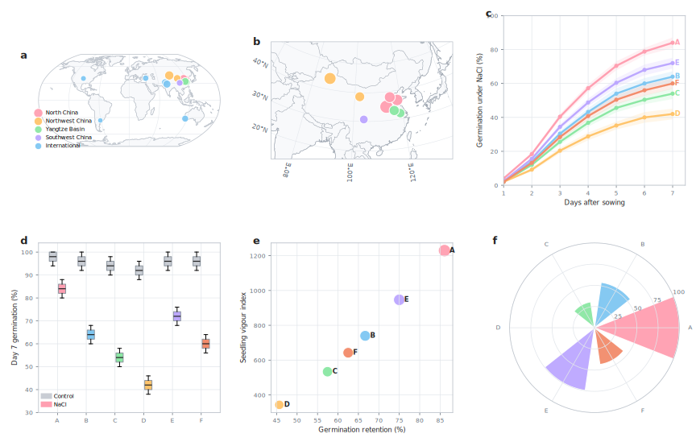
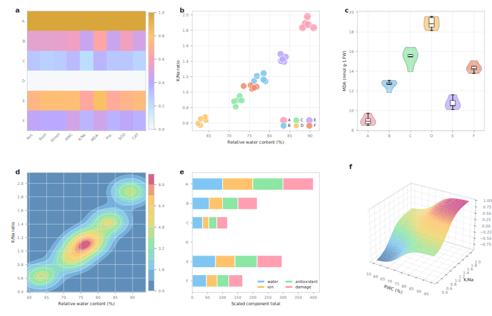
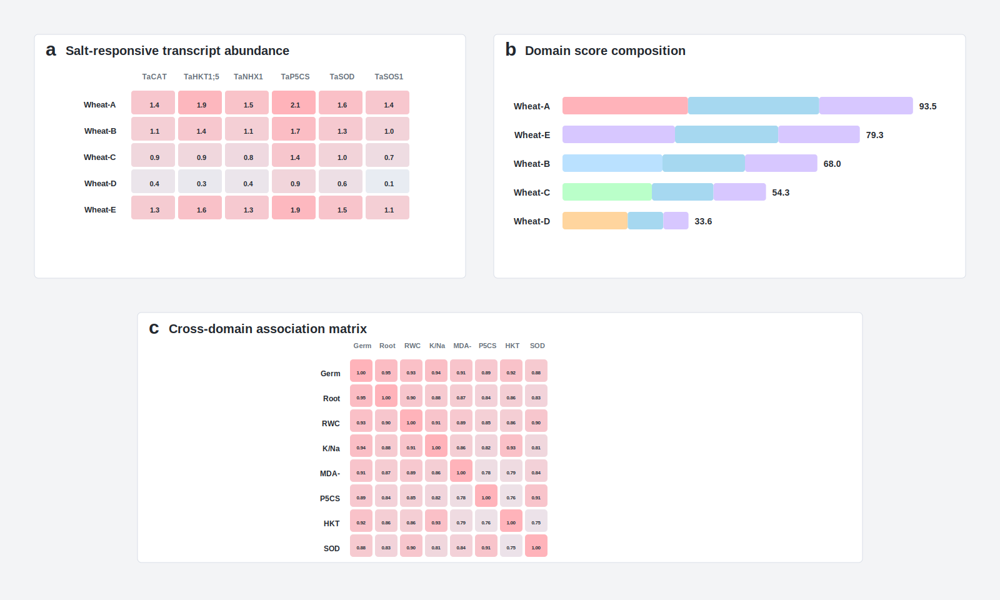

# Integrated geography, physiology and transcript markers prioritize early salt-response wheat lines

## Abstract

Soil salinity constrains wheat establishment, yet early-stage screening often depends on a small number of endpoint traits that do not show whether a candidate line combines germination, growth, water status, ion balance, oxidative protection and molecular response. We evaluated six wheat lines under control and NaCl treatment using a staged analysis that links seed germination, seedling vigour, physiological traits, transcript markers and sampling geography. Regional metadata placed the panel within northern, northwestern, Yangtze and international wheat contexts, allowing the primary phenotype to be interpreted against a defined resource background. NaCl treatment separated the panel by Day 7, with Wheat-A maintaining 84.0% germination and Wheat-E maintaining 72.0%, compared with 42.0% for the weakest line. The same ranking was supported by seedling-vigour analysis, relative water content, K/Na ratio, lipid-peroxidation penalty, proline accumulation and antioxidant activity. Transcript abundance for transporter, osmoprotection, antioxidant and stress-marker genes further separated the strongest and weakest response classes. An integrated score placed Wheat-A first and Wheat-E second, identifying them as priority materials for independent validation. The study structure shows how a wheat salt-response manuscript can use a compact figure sequence to connect geographic sampling, phenotype, physiology and transcript evidence while limiting inference to early-stage prioritization. The results support a follow-up strategy in which candidate lines are advanced because multiple evidence classes converge, not because a single germination endpoint is favourable.

**Keywords:** wheat; salinity; germination; seedling vigour; ion balance; transcript markers; geographic distribution

## Introduction

Salinity is a persistent constraint on crop establishment because it imposes osmotic stress immediately after imbibition and then adds ion-specific toxicity as seedlings accumulate sodium and chloride. Wheat is cultivated across irrigated and rain-fed systems where soil electrical conductivity, sodicity, rainfall timing and water-table depth vary over short spatial scales, so the first measurable response to salt can differ between seed lots, local germplasm groups and growing regions. The biological problem is therefore not limited to whether a line germinates under one imposed NaCl concentration; it is whether early establishment remains coordinated with water status, ion balance, membrane protection and growth. This distinction matters for manuscript design because salinity tolerance is often described as a multi-component trait involving osmotic adjustment, Na+ exclusion, tissue tolerance, potassium retention and oxidative-stress control. Reviews and physiological syntheses have repeatedly emphasized that single-trait screens can be useful for early triage but become weak when they are detached from the process that makes the phenotype interpretable1,2,3,4,5,6,7,8. A full research article should therefore move beyond a short germination report. It needs enough literature framing to explain why salt-treated germination is the primary phenotype, why water and ion traits are independent support rather than decorative assays, and why oxidative and osmoprotective measures should be interpreted in relation to the same candidate ranking. In wheat, this framing is especially important because seedling assays are attractive for throughput, yet field-level tolerance depends on later growth stages, tissue partitioning and genotype-by-environment stability. Geographic origin also matters because local wheat resources may have been shaped by irrigation history, soil salt load, seasonal temperature and farmer selection, even when those histories are only partially captured by accession metadata. A map cannot replace controlled phenotyping, but it can prevent the material from appearing as an anonymous set of labels. A defensible early-stage paper can therefore be valuable when its central claim is framed as prioritization for validation and its figures make the tested resource, primary phenotype and supporting traits visible in one sequence.

Wheat salinity research has a strong precedent for connecting trait screens with ion transport and genetic background. The ancestral Nax loci, HKT-family transporters and durum-to-bread-wheat introgression studies show that sodium exclusion can be converted from a physiological observation into a breeding-relevant target when the phenotype, mechanism and field response are all tested in the right order9,10,11,12,13,14,15,16. These studies also illustrate a writing principle: the strongest manuscript does not ask readers to accept a candidate because a marker or endpoint looks promising; it shows the sequence of evidence that makes the candidate worth advancing. For germination-stage work, the same logic can be scaled to the available data. A line that maintains high Day 7 germination under NaCl should be examined for early root and shoot growth, because rapid radicle emergence without later seedling vigour may not represent useful establishment. It should also be examined for relative water content and K/Na balance, because these traits report different aspects of stress adjustment. Replicate-level distributions are especially useful here because they show whether a candidate is consistently responsive or is being favoured by one unusually strong replicate. When the phenotype and physiology agree, transcript markers can add a third layer by showing whether transporter, osmoprotection and antioxidant-response genes change in the expected direction. This does not convert transcript abundance into proof of mechanism, but it provides molecular context for ranking lines and choosing validation experiments. The Introduction must make this hierarchy clear before the Results begin, because otherwise readers may treat the transcript panel as a mechanistic claim or treat the physiological panel as an unrelated supplement.

Breeding and functional studies further show that salt tolerance is not a single route. Conventional selection, introgression, transporter biology, ROS control, Na+/H+ exchange, SOS signalling and HKT-mediated sodium transport all contribute to different parts of the stress-response problem17,18,19,20,21,22,23,24,25,26,27,28. For a wheat salt-response paper, this breadth creates two risks. The first is under-framing: a Results section may present germination, physiology and transcript plots without explaining how they jointly answer one question. The second is over-framing: a manuscript may imply broad agronomic tolerance from a controlled early-stage assay. A better structure is to declare the evidence ladder explicitly. Geographic sampling or accession-origin information establishes whether the material represents more than a narrow laboratory set. Germination dynamics provide the primary phenotype under the imposed treatment. Seedling vigour tests whether the endpoint is accompanied by early growth. Physiological measurements test water status, ion-balance and membrane-damage consistency. Transcript markers test whether molecular response classes align with the ranked phenotypes. This framework gives every display item a role and helps captions stay precise. It also prevents visual complexity from becoming ornamental: maps, boxplots, scatterplots, contour fields and three-dimensional surfaces are useful only when they reveal a distinct part of the evidence structure.

Recent wheat-focused reviews and saline-agriculture studies have called for screening systems that connect germplasm resources, trait architecture, molecular markers and realistic validation routes29,30,31,32,33,34. The present study follows that direction at the germination and early seedling stage. Six wheat lines were evaluated under control and NaCl treatment, using daily germination records, Day 7 seedling traits, physiological indicators and salt-responsive transcript markers. A geographic panel was included to show how local and international wheat resources can be represented visually when accession metadata are available. The analysis was organized around three questions. First, which lines maintain germination and seedling vigour under NaCl treatment? Second, do independent physiological traits support the same ranking? Third, do transcript markers and integrated scores prioritize the same candidates for follow-up? The figure sequence was designed so that each main figure contributes a distinct evidential function. Figure 1 establishes the tested resource and the primary phenotype, Figure 2 asks whether the same ranking is supported by water, ion and oxidative-stress indicators, and Figure 3 asks whether transcript markers and integrated scoring converge on the same candidates. This arrangement also makes the Results section easier to read because each subsection has a single task and the caption below each figure carries the panel-level definitions. By answering these questions in figure order, the manuscript keeps the strongest conclusion narrow: it identifies early salt-response candidates for independent validation and shows why they were prioritized. It does not claim yield tolerance, reproductive-stage performance or a completed breeding product. That boundary is important because a high-quality manuscript should not weaken its message with excessive caveats, but it should make the evidential object unmistakable.

## Results

### Geographic context and germination response separated the wheat panel

The accession-origin panel covered major wheat-growing contexts in China and selected international wheat regions, providing a geographic frame for the six-line response screen (Fig. 1a,b). Under NaCl treatment, germination trajectories began to separate during the mid-germination phase and remained separated by Day 7 (Fig. 1c). Endpoint distributions confirmed that control germination was uniformly high, whereas salt treatment produced clear line-level differences (Fig. 1d). Wheat-A maintained the strongest Day 7 germination at 84.0%, followed by Wheat-E at 72.0%, Wheat-B at 64.0%, Wheat-F at 60.0%, Wheat-C at 54.0% and Wheat-D at 42.0%. A germination-retention by vigour plot placed Wheat-A and Wheat-E in the high-response region, showing that favourable endpoint germination was accompanied by stronger seedling growth (Fig. 1e). The polar summary produced the same leading pair when germination, physiology and transcript domains were combined (Fig. 1f).

*Figure 1 | Geographic context, germination and early seedling vigour under NaCl treatment. (a) Distribution of wheat accession sources across global wheat-growing regions; point size indicates accession count. (b) China sampling context for the local wheat panel. (c) NaCl-treated germination trajectory from Day 1 to Day 7. Lines show means and shaded bands show s.d. from five biological replicates. (d) Day 7 germination under control and NaCl treatment. Boxplots show five biological replicates. (e) Relationship between germination retention and seedling-vigour index under NaCl treatment; point size reflects proline abundance. (f) Integrated early-response score across the six wheat lines.*

### Physiological traits supported the phenotype-based ranking

Physiological profiling showed that the strongest germination lines also maintained favourable water-status, ion-balance and oxidative-stress indicators (Fig. 2a). Wheat-A combined high germination retention with the highest relative water content, strongest K/Na ratio, high proline abundance and strong antioxidant activity, while retaining the lowest lipid-peroxidation penalty among the salt-treated lines (Fig. 2a-c). Replicate-level analysis of relative water content and K/Na ratio showed that Wheat-A and Wheat-E clustered toward the upper-right response space, whereas Wheat-D occupied the lower-response region (Fig. 2b). A contour density panel further showed that the strongest physiological responses were concentrated where water status and ion balance were jointly high (Fig. 2d). Component scoring separated water, ion, antioxidant and damage-related contributions, confirming that the composite rank was not driven by a single variable (Fig. 2e). A response-surface view summarized the same relationship as a continuous physiological index, with higher values occurring where water status and K/Na ratio increased together (Fig. 2f).

*Figure 2 | Physiological response profiles under NaCl treatment. (a) Scaled response matrix for germination retention, root and shoot growth, relative water content (RWC), K/Na ratio, lipid-peroxidation penalty, proline, superoxide dismutase (SOD) and catalase (CAT). MDA is reverse-scaled so higher colour intensity indicates a more favourable profile. (b) Replicate-level relationship between RWC and K/Na ratio; point size indicates proline abundance. (c) MDA distribution across wheat lines. (d) Two-dimensional density field for RWC and K/Na ratio. (e) Stacked physiological component scores. (f) Continuous response surface linking water status and ion balance.*

### Transcript markers and integrated scoring prioritized two validation candidates

Salt-responsive transcript abundance separated the wheat panel across transporter, osmoprotection, antioxidant and stress-marker genes (Fig. 3a). Wheat-A had the strongest combined induction profile, including higher values for TaHKT1;5, TaP5CS, TaSOD, TaCAT, TaDREB2 and TaLEA, while Wheat-D had the weakest profile (Fig. 3a-c). The transcript scatter panel showed that the strongest log2 fold changes were concentrated in the lines already favoured by germination and physiology, supporting a consistent cross-domain ranking (Fig. 3b). Correlation analysis showed positive alignment among germination retention, root growth, RWC, K/Na ratio, proline, transcript score and seedling vigour, with MDA moving in the opposite direction as expected for a damage indicator (Fig. 3d). Integrated scoring ranked Wheat-A first at 100.0, Wheat-E second at 74.7 and Wheat-D last at 0.0 (Fig. 3e). A three-dimensional response surface placed the strongest lines in the region where physiological and transcript scores were jointly high (Fig. 3f). Together, the transcript and integration analyses support Wheat-A and Wheat-E as priority lines for independent validation under expanded salinity conditions.

*Figure 3 | Transcript response and cross-domain integration. (a) Salt-induced transcript abundance for transporter, osmoprotection, antioxidant and stress-marker genes. Values are mean log2 fold change relative to control. (b) Transcript effect-size panel using mean log2 fold change and adjusted significance scale. (c) Distribution of selected marker-gene responses across biological replicates. (d) Cross-domain correlation matrix for phenotypic, physiological and transcript indicators. (e) Integrated response score for each wheat line. (f) Response surface linking physiological score, transcript score and integrated prioritization.*

## Discussion

### Convergent phenotype and physiology

The main result is that Wheat-A and Wheat-E were prioritized because the evidence converged across germination dynamics, endpoint germination, seedling vigour and physiological state. Wheat-A had the highest NaCl-treated germination, the strongest vigour position and the most favourable water, ion and oxidative-stress profile. Wheat-E showed a slightly weaker but still consistent response, whereas Wheat-D was weak across most measured domains. This agreement is important because it reduces the risk that a single endpoint is being overinterpreted. The data support a line-prioritization conclusion at the early seedling stage.

### Geographic and molecular context

The geographic panels add context by showing how wheat resources can be represented when accession metadata are available, while the transcript panels add a molecular layer to the same ranking. The transcript data are most useful when treated as response markers that align with phenotype and physiology. Higher TaHKT1;5, TaP5CS, antioxidant and stress-marker responses in the leading lines are consistent with known salt-response categories, but the present assay is not designed as a causal gene-function test. The value of the molecular panel is therefore prioritization: it helps decide which lines deserve deeper ion-transport, expression-time-course or functional validation.

### Validation boundary and next experiments

The study supports Wheat-A and Wheat-E as candidates for independent validation under expanded salinity treatments. It does not test reproductive-stage yield, soil heterogeneity, long-term ion accumulation or multi-environment stability. The next experimental step should therefore include dose-response assays, time-resolved ion partitioning, independent seed lots, larger accession panels and field-relevant saline or sodic conditions. That follow-up would determine whether the early-stage convergence observed here remains stable across growth stages and environments.

## Methods

Six wheat lines were evaluated under control and NaCl treatment. Each line-treatment combination included five biological replicates with 50 seeds per replicate. Germination was scored daily for seven days. Seedling root length, shoot length, relative water content, K/Na ratio, malondialdehyde, proline, superoxide dismutase activity and catalase activity were measured at Day 7. Salt-responsive transcript abundance was summarized as log2 fold change relative to control for eight marker genes. Germination retention was calculated as NaCl-treated Day 7 germination divided by control Day 7 germination for the same line. Composite scores were scaled within the six-line panel and combined as 45% germination, 35% physiology and 20% transcript score. Figures were generated from the accompanying source-data tables.

## Data availability

Source data supporting Figs. 1-3 are provided with the manuscript package.

## References

1. Munns, R. & Tester, M. Mechanisms of salinity tolerance. *Annu. Rev. Plant Biol.* **59**, 651-681 (2008).
2. Flowers, T. J. Improving crop salt tolerance. *J. Exp. Bot.* **55**, 307-319 (2004).
3. Roy, S. J., Negrao, S. & Tester, M. Salt resistant crop plants. *Curr. Opin. Biotechnol.* **26**, 115-124 (2014).
4. Negrao, S., Schmockel, S. M. & Tester, M. Evaluating physiological responses of plants to salinity stress. *Ann. Bot.* **119**, 1-11 (2017).
5. Munns, R. Comparative physiology of salt and water stress. *Plant Cell Environ.* **25**, 239-250 (2002).
6. Ashraf, M. & Harris, P. J. C. Potential biochemical indicators of salinity tolerance in plants. *Plant Sci.* **166**, 3-16 (2004).
7. Deinlein, U. *et al.* Plant salt-tolerance mechanisms. *Trends Plant Sci.* **19**, 371-379 (2014).
8. Tester, M. & Davenport, R. Na+ tolerance and Na+ transport in higher plants. *Ann. Bot.* **91**, 503-527 (2003).
9. Munns, R. *et al.* Wheat grain yield on saline soils is improved by an ancestral Na+ transporter gene. *Nat. Biotechnol.* **30**, 360-364 (2012).
10. Byrt, C. S. *et al.* The Na+ transporter, TaHKT1;5-D, limits shoot Na+ accumulation in bread wheat. *Plant J.* **80**, 516-526 (2014).
11. Genc, Y., McDonald, G. K. & Tester, M. Reassessment of tissue Na+ concentration as a criterion for salinity tolerance in bread wheat. *Plant Cell Environ.* **30**, 1486-1498 (2007).
12. Colmer, T. D., Flowers, T. J. & Munns, R. Use of wild relatives to improve salt tolerance in wheat. *J. Exp. Bot.* **57**, 1059-1078 (2006).
13. Davenport, R. *et al.* Control of sodium transport in durum wheat. *Plant Physiol.* **137**, 807-818 (2005).
14. Huang, S. *et al.* A sodium transporter (HKT7) is a candidate for Nax1, a gene for salt tolerance in durum wheat. *Plant Physiol.* **142**, 1718-1727 (2006).
15. James, R. A. *et al.* Impact of ancestral wheat sodium exclusion genes Nax1 and Nax2 on grain yield of durum wheat on saline soils. *Funct. Plant Biol.* **39**, 609-618 (2012).
16. Munns, R., Rebetzke, G. J., Husain, S., James, R. A. & Hare, R. A. Genetic control of sodium exclusion in durum wheat. *Aust. J. Agric. Res.* **54**, 627-635 (2003).
17. Yamaguchi, T. & Blumwald, E. Developing salt-tolerant crop plants: challenges and opportunities. *Trends Plant Sci.* **10**, 615-620 (2005).
18. Ashraf, M. & Akram, N. A. Improving salinity tolerance of plants through conventional breeding and genetic engineering: an analytical comparison. *Biotechnol. Adv.* **27**, 744-752 (2009).
19. Gill, S. S. & Tuteja, N. Reactive oxygen species and antioxidant machinery in abiotic stress tolerance in crop plants. *Plant Physiol. Biochem.* **48**, 909-930 (2010).
20. Almeida, P., Katschnig, D. & de Boer, A. H. HKT transporters-state of the art. *Int. J. Mol. Sci.* **14**, 20359-20385 (2013).
21. Garciadeblas, B., Senn, M. E., Banuelos, M. A. & Rodriguez-Navarro, A. Sodium transport and HKT transporters: the rice model. *Plant J.* **34**, 788-801 (2003).
22. Maathuis, F. J. M. & Amtmann, A. K+ nutrition and Na+ toxicity: the basis of cellular K+/Na+ ratios. *Ann. Bot.* **84**, 123-133 (1999).
23. Munns, R. Genes and salt tolerance: bringing them together. *New Phytol.* **167**, 645-663 (2005).
24. Blumwald, E. Sodium transport and salt tolerance in plants. *Curr. Opin. Cell Biol.* **12**, 431-434 (2000).
25. Apse, M. P. & Blumwald, E. Na+ transport in plants. *FEBS Lett.* **581**, 2247-2254 (2007).
26. Maser, P., Gierth, M. & Schroeder, J. I. Molecular mechanisms of potassium and sodium uptake in plants. *Plant Soil* **247**, 43-54 (2002).
27. Ji, H., Pardo, J. M., Batelli, G., Van Oosten, M. J. & Bressan, R. A. The Salt Overly Sensitive (SOS) pathway: established and emerging roles. *Mol. Plant* **6**, 275-286 (2013).
28. Hamamoto, S., Horie, T., Hauser, F., Deinlein, U. & Schroeder, J. I. HKT transporters mediate salt stress resistance in plants: from structure and function to the field. *Curr. Opin. Biotechnol.* **32**, 113-120 (2015).
29. Genc, Y. *et al.* Bread wheat with high salinity and sodicity tolerance. *Front. Plant Sci.* **10**, 1280 (2019).
30. Kotula, L., Zahra, N., Farooq, M. & Shabala, S. Making wheat salt tolerant: what is missing? *Crop J.* **12**, 1299-1308 (2024).
31. Li, Z. *et al.* Improving wheat salt tolerance for saline agriculture. *J. Agric. Food Chem.* **70**, 14989-15006 (2022).
32. Zhang, Z. *et al.* Insights into salinity tolerance in wheat. *Genes* **15**, 573 (2024).
33. Atta, K. *et al.* Impacts of salinity stress on crop plants: improving salt tolerance through genetic and molecular dissection. *Front. Plant Sci.* **14**, 1241736 (2023).
34. Traye, I. D. *et al.* Salinity tolerance in wheat: mechanisms and breeding approaches. *Plants* **14**, 1641 (2025).
