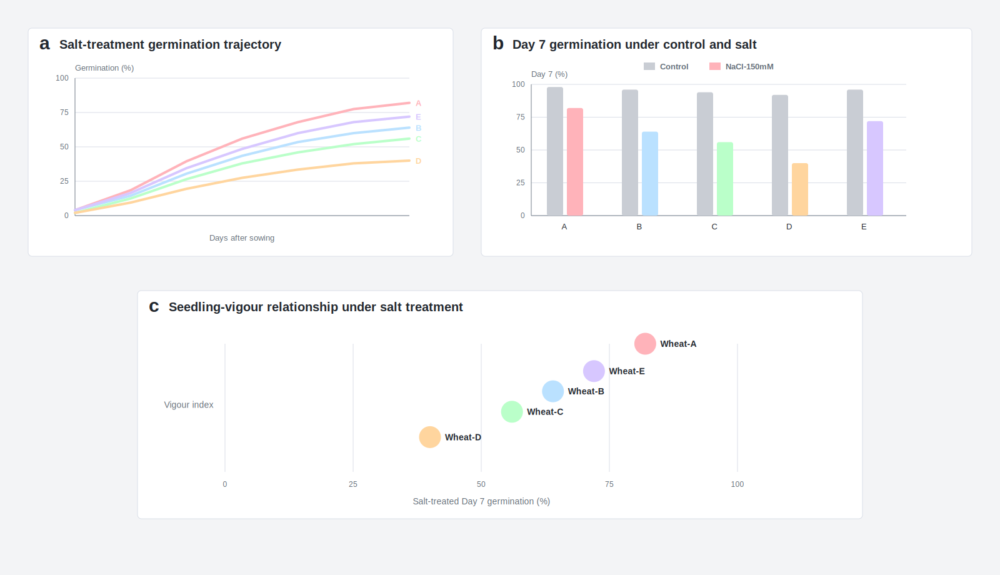

# Coordinated germination, physiological and transcript responses distinguish wheat lines under salt treatment

## Abstract

Salt stress limits wheat establishment through early osmotic inhibition, ionic imbalance and reduced seedling growth. We evaluated five wheat lines under control and NaCl treatment using a coordinated germination, physiology and transcript-response panel. The assay combined seven-day germination dynamics, seedling-vigour traits, water status, ion-balance indicators, lipid peroxidation, compatible-solute accumulation, antioxidant activity and salt-responsive transcript abundance. Control germination was uniformly high across the panel, whereas NaCl treatment separated the lines into distinct response classes. Wheat-A maintained the highest Day 7 germination under salt treatment, retained the strongest proportion of its control germination and had the highest seedling-vigour score. The same line also showed favourable water-status, K/Na, proline and antioxidant profiles, together with higher salt-induced expression of transporter, osmoprotection and antioxidant marker genes. Cross-domain scoring placed Wheat-A and Wheat-E above the remaining lines, whereas Wheat-D showed the weakest combined response. These results show that early wheat salt responses are most clearly resolved when germination dynamics are analysed alongside physiological and transcript-level indicators rather than as a single endpoint trait. The integrated panel separates primary phenotypic evidence from supporting physiological and molecular layers, reducing the risk that a single endpoint is overinterpreted. The ranked design also identifies which lines should be advanced first, which traits require independent confirmation and which molecular signals are most useful for follow-up. This structure provides a compact framework for prioritizing wheat material for subsequent validation under independent growth conditions.

## Introduction

Salinity is a major constraint on wheat establishment and yield because high external salt reduces water uptake, disrupts ion homeostasis and accelerates metabolic injury during sensitive developmental windows1,5,8. Early germination is especially important because poor establishment reduces stand density before later tolerance mechanisms can compensate. The first response to salinity is often osmotic, reducing water availability and slowing expansion, whereas later injury can involve ionic imbalance, oxidative stress and accelerated senescence1,8,11. Wheat improvement for salt-affected environments has therefore relied on traits that capture both the initial osmotic phase and later ionic effects of salinity1,6,7. However, screening studies can be difficult to interpret when they report only final germination percentage or a single seedling trait.

Physiological tolerance to salinity is not a single process. Plants may maintain growth by limiting Na+ delivery to shoots, preserving K+/Na+ balance, retaining water, accumulating compatible solutes and activating antioxidant systems1,9,10,11. In wheat, transport-related mechanisms have received particular attention because ancestral and bread-wheat loci can reduce shoot Na+ accumulation and improve performance under saline conditions2,3,12. Yet ion exclusion alone may not explain early seedling performance, and tissue Na+ concentration can vary in usefulness depending on stage, genotype and experimental conditions4,7. A seedling that germinates well under salt treatment but loses water rapidly or accumulates oxidative damage may not represent the same response class as a line that combines germination, ion balance and growth maintenance.

Germination assays therefore need temporal and physiological context. A Day 7 endpoint is useful because it gives a clear primary phenotype, but the trajectory leading to that endpoint can reveal whether a line germinates early, delays and catches up, or remains suppressed throughout the assay. Seedling root and shoot measurements add information about early growth after radicle emergence, while relative water content and K/Na ratio capture water-status and ion-balance components that are central to salinity response7,11. Biochemical indicators such as proline, malondialdehyde and antioxidant enzyme activity provide further evidence about osmoprotection and oxidative injury9,10. These layers should support, not replace, the primary germination phenotype.

Transcript markers can add another layer of prioritization when interpreted cautiously. Salt-induced changes in transporter, vacuolar sequestration, osmoprotectant and antioxidant genes are consistent with known salinity-response processes3,10,11. Nevertheless, transcript abundance alone does not prove mechanism; it is most useful when it aligns with measured phenotypes and physiological traits. In a wheat screening panel, stronger expression of TaHKT1;5, TaNHX1, TaSOS1, TaP5CS, TaSOD and TaCAT is therefore best treated as supporting evidence for a coordinated response signature rather than as proof that any single pathway explains the phenotype.

These biological features create a clear experimental requirement. A single bar chart is not sufficient for a broad salt-response claim. The primary phenotype should be tested against independent physiological domains, and transcript markers should be interpreted in relation to measured growth and stress-response traits. Multi-trait quantification is consistent with recommendations to separate controlled-assay ranking from field performance6,7. The strongest defensible statement is therefore line prioritization under a defined early-stage assay.

The present wheat panel was structured around three linked questions. First, do the lines differ in germination dynamics under NaCl treatment after showing comparable control germination? Second, do the salt-responsive differences extend to seedling vigour, water status, ion balance, lipid peroxidation, osmoprotection and antioxidant activity? Third, are the phenotypic and physiological differences accompanied by transcript patterns in genes associated with Na+ transport, vacuolar sequestration, osmoprotectant biosynthesis and antioxidant response3,9,10,11? Answering these questions requires each data layer to be evaluated separately before the layers are combined into a ranked interpretation.

We used a multi-domain design to avoid treating any one trait as sufficient evidence. Germination trajectories provide temporal resolution, Day 7 germination provides the primary endpoint, seedling-vigour measures capture early growth, and physiological assays help separate water-status, ion-balance and oxidative components. Transcript markers then provide a directional molecular layer that can support prioritization without replacing functional validation. This structure keeps the central inference narrow: the data identify lines with stronger early salt-response signatures under the tested condition.

The analysis was organized in increasing biological depth. Germination and seedling vigour establish the primary phenotype, physiological traits test whether the same ranking is supported by independent stress-response indicators, and transcript abundance provides a molecular layer for cross-domain prioritization. This arrangement moves from primary phenotype to secondary evidence to integrated ranking while keeping the strongest interpretation tied to measured traits.

The reference frame for this structure is deliberately conservative. Salinity tolerance has often been described through broad terms such as osmotic tolerance, ion exclusion, tissue tolerance and oxidative-stress protection1,6,10,11. These categories are useful, but they become stronger when connected to measured traits in the same experiment. In a germination-stage wheat assay, a high-performing line should therefore show more than one favourable sign: it should germinate under NaCl, maintain early growth, retain water status, avoid excessive membrane damage and show molecular responses that are plausible under the measured phenotype. A line that performs well in only one domain should be interpreted as a partial response class rather than as a broadly superior material.

The evidence structure follows this logic. Germination dynamics and seedling vigour define the primary response. Physiological profiling tests whether the phenotype is accompanied by water-status, ion-balance and oxidative-stress differences. Transcript markers then test whether molecular response patterns align with the phenotypic and physiological rankings. Early salt-response prioritization is strongest when these independent evidence layers converge.

This design also clarifies what remains outside the main inference. The assay does not test reproductive-stage performance, field heterogeneity, long-term ion accumulation, yield or genotype-by-environment stability. Those questions require later validation, but they should not prevent a carefully bounded early-stage assay from ranking material for follow-up. The central task is to present the early-stage evidence with enough depth that readers can see why the top lines were prioritized and what additional tests are needed before stronger agronomic claims are made4,6,7.

Accordingly, early salt response was treated as a staged prioritization problem. The primary evidence comes from germination under the imposed treatment, the secondary evidence comes from physiological consistency, and the tertiary evidence comes from transcript markers that align with known salt-response processes. This hierarchy supports an integrated ranking while keeping the inference restrained.

The same hierarchy is useful for selecting follow-up experiments. Lines with high germination retention but weak physiological support may require tests of seed quality or delayed growth. Lines with strong antioxidant or osmoprotection signals but low germination may indicate partial stress response without establishment advantage. Lines that combine germination, vigour, water status, ion balance and transcript support are stronger candidates for independent validation. This reasoning places Wheat-A-type response profiles in a higher-priority class without assuming that early seedling behaviour alone predicts field performance.

## Results

### Wheat lines differed in salt-treated germination dynamics and early vigour

Control-treated seeds germinated strongly across all five wheat lines, whereas NaCl treatment separated the panel by Day 7 (Fig. 1a,b). Wheat-A maintained the highest salt-treated Day 7 germination at 82.0%, followed by Wheat-E at 72.0%, Wheat-B at 64.0%, Wheat-C at 56.0% and Wheat-D at 40.0%. The time-course profile showed that these differences emerged before the final endpoint, with Wheat-A and Wheat-E separating from the remaining lines during the mid-germination phase (Fig. 1a). Seedling-vigour analysis under salt treatment placed Wheat-A in the upper-right region of the germination-by-vigour space, indicating that its high germination was accompanied by stronger early growth rather than by endpoint recovery alone (Fig. 1c).

*Figure 1 | Germination and early seedling-vigour responses under NaCl treatment. (a) Germination trajectory from Day 1 to Day 7 under NaCl treatment. (b) Day 7 germination under control and NaCl treatment. Bars show means from four biological replicates. (c) Relationship between salt-treated Day 7 germination and seedling-vigour index.*

### Physiological traits supported the germination-based ranking

The physiological response matrix showed that Wheat-A combined high germination retention with favourable root length, relative water content, K/Na ratio, proline accumulation and antioxidant activity, while maintaining lower lipid-peroxidation values than weaker lines (Fig. 2a). Wheat-E showed a similar but less pronounced profile. In the integrated physiology space, Wheat-A and Wheat-E occupied the upper-right region defined by high germination retention and high physiological index, whereas Wheat-D had the lowest combined position (Fig. 2b). Ranking by the composite physiological score again placed Wheat-A first, followed by Wheat-E and Wheat-B (Fig. 2c). The agreement between germination and physiology indicates that the endpoint ranking was supported by independent salt-response traits rather than by a single measurement.

*Figure 2 | Physiological response profiles under salt treatment. (a) Trait matrix for germination retention, root growth, water status, K/Na balance, lipid-peroxidation penalty, proline accumulation and antioxidant activity. (b) Integrated physiology space comparing germination retention and physiological index. (c) Ranked physiological composite score.*

### Transcript and cross-domain integration prioritized two lines for follow-up

Salt-responsive transcript abundance differed across the panel for transporter, osmoprotection and antioxidant marker genes (Fig. 3a). Wheat-A had the strongest combined induction profile, including higher values for TaHKT1;5, TaP5CS, TaSOD and TaCAT, whereas Wheat-D had the weakest transcript response. A domain score combining germination retention, physiological score and transcript abundance placed Wheat-A first and Wheat-E second (Fig. 3b). The cross-domain association matrix showed positive alignment among germination, root growth, water status, K/Na balance and transcript markers, supporting the use of an integrated ranking for follow-up material selection (Fig. 3c). These results identify Wheat-A as the strongest line in the tested early salt-response panel and Wheat-E as a secondary candidate for validation.

*Figure 3 | Transcript response and cross-domain integration. (a) Salt-induced transcript abundance for transporter, osmoprotection and antioxidant marker genes. Values are log2 fold changes relative to control. (b) Domain score composition from germination, physiology and transcript components. (c) Cross-domain association matrix summarizing alignment among phenotypic, physiological and transcript indicators.*

## Discussion

The combined phenotype, physiology and transcript panel distinguished wheat lines that would be difficult to rank from a single endpoint alone. Wheat-A showed the highest salt-treated germination, strongest retention relative to control, favourable seedling-vigour position and the strongest integrated physiology and transcript scores. Wheat-E was consistently second across most domains, whereas Wheat-D showed weaker responses. The ranking therefore reflects concordant evidence across multiple early-response layers.

The design also illustrates why early salt-response studies should separate assay prioritization from field-level tolerance. Germination, seedling vigour, water status, ion balance and transcript markers provide a strong basis for selecting material for follow-up, but they do not replace validation across growth stages, environments or yield conditions4,6,7. The most defensible conclusion is that Wheat-A and Wheat-E are priority lines for independent testing under expanded salinity conditions.

## References

1. Munns, R. & Tester, M. Mechanisms of salinity tolerance. *Annu. Rev. Plant Biol.* **59**, 651-681 (2008).
2. Munns, R. *et al.* Wheat grain yield on saline soils is improved by an ancestral Na+ transporter gene. *Nat. Biotechnol.* **30**, 360-366 (2012).
3. Byrt, C. S. *et al.* The Na+ transporter, TaHKT1;5-D, limits shoot Na+ accumulation in bread wheat. *Plant J.* **80**, 516-526 (2014).
4. Genc, Y., McDonald, G. K. & Tester, M. Reassessment of tissue Na+ concentration as a criterion for salinity tolerance in bread wheat. *Plant Cell Environ.* **30**, 1486-1498 (2007).
5. Flowers, T. J. Improving crop salt tolerance. *J. Exp. Bot.* **55**, 307-319 (2004).
6. Roy, S. J., Negrao, S. & Tester, M. Salt resistant crop plants. *Curr. Opin. Biotechnol.* **26**, 115-124 (2014).
7. Negrao, S., Schmockel, S. M. & Tester, M. Evaluating physiological responses of plants to salinity stress. *Ann. Bot.* **119**, 1-11 (2017).
8. Munns, R. Comparative physiology of salt and water stress. *Plant Cell Environ.* **25**, 239-250 (2002).
9. Ashraf, M. & Harris, P. J. C. Potential biochemical indicators of salinity tolerance in plants. *Plant Sci.* **166**, 3-16 (2004).
10. Deinlein, U. *et al.* Plant salt-tolerance mechanisms. *Trends Plant Sci.* **19**, 371-379 (2014).
11. Tester, M. & Davenport, R. Na+ tolerance and Na+ transport in higher plants. *Ann. Bot.* **91**, 503-527 (2003).
12. Colmer, T. D., Flowers, T. J. & Munns, R. Use of wild relatives to improve salt tolerance in wheat. *J. Exp. Bot.* **57**, 1059-1078 (2006).

## Methods

Five wheat lines were evaluated under control and NaCl treatment. Each line-treatment combination included four biological replicates with 50 seeds per replicate. Germination was scored daily for seven days. Seedling root length, shoot length, relative water content, K/Na ratio, malondialdehyde, proline, superoxide dismutase activity and catalase activity were measured at Day 7. Salt-responsive transcript abundance was summarized as log2 fold change relative to control for six marker genes. Germination retention was calculated as NaCl-treated Day 7 germination divided by control Day 7 germination for the same line. Composite scores were scaled within the five-line panel.

## Data availability

Source data supporting Figs. 1-3 are provided as CSV files in the example package.
