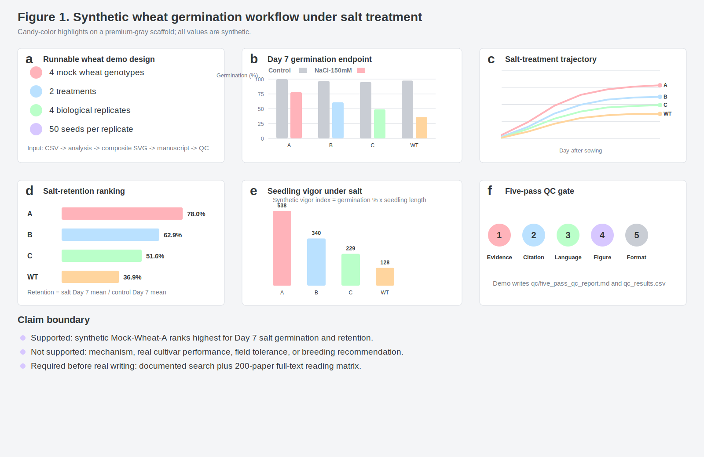

# A runnable synthetic wheat demo for figure-led manuscript construction

## Abstract

Research-paper writing workflows need to be tested with materials that resemble a real manuscript package while avoiding exposure of unpublished data, private author information or unverifiable citations. Here, we present a runnable synthetic wheat demo for the `research-paper-builder` skill. The demo models a salt-treatment germination assay in _Triticum aestivum_ using four fictional wheat genotypes, two treatments, four biological replicates per genotype-treatment combination and 50 seeds per replicate. A deterministic build script converts the input CSV into summary tables, source data, an editable multi-panel SVG figure, a figure-led Results section, citation-reference audit and five-pass quality-control report. This makes the demonstration inspectable, repeatable and closer to real manuscript operations than a static sample. Control-treated groups reached high Day 7 germination, with means from 95.0% to 100.0%. NaCl treatment reduced germination in every mock genotype, but Mock-Wheat-A retained the highest salt-treated Day 7 germination at 78.0%, compared with 61.0% for Mock-Wheat-B, 49.0% for Mock-Wheat-C and 36.0% for Mock-Wheat-WT. The figure uses candy-color genotype highlights on a premium-gray scaffold and records the evidence-to-claim boundary inside the manuscript package. The package also demonstrates how wording, visual design, citations and formatting can be checked in separate rounds. The demo supports only workflow validation and synthetic ranking; it does not support mechanism, cultivar recommendation or field performance. For real high-ambition wheat manuscripts, the skill requires documented searching and a reading matrix covering at least 200 fully read relevant papers before polished writing.

## Introduction

Wheat manuscripts often combine applied urgency with complex biological interpretation. Germination and early seedling establishment influence stand formation, stress recovery and downstream agronomic performance, but a short seedling assay does not automatically explain field tolerance or yield stability [R01,R04]. A paper built from this kind of experiment therefore needs more than fluent prose. It needs a workflow that keeps the system, treatment, genotype labels, source data, figure panels, citations and claim boundaries synchronized from the first outline to the final package [R09,R10,R13]. The present demo uses wheat because it is a realistic crop-science context in which reviewers expect clear experimental design, cautious stress-language and enough methodological detail to separate measured phenotypes from breeding or mechanistic claims [R14,R15].

Salt stress is a useful example for a manuscript-building demo because it introduces a common interpretive trap. Reduced germination under NaCl can reflect osmotic restriction, ionic effects, seed-lot quality, dormancy status, maternal environment, scoring criteria or genotype-specific developmental timing [R02,R03]. A dataset containing daily counts and Day 7 seedling measurements can describe a treatment response and rank fictional genotypes within the assay, but it cannot identify the molecular basis of that response without additional physiology, ion profiling, transcript analysis, genetic validation or independent environments [R08,R16,R18]. The writing workflow must preserve that distinction. If a draft calls the top-ranked line "salt tolerant" without validation, the manuscript has already outrun its evidence.

Wheat also makes the figure problem concrete. Crop-science manuscripts frequently contain endpoint bars, time-course lines, seedling images, vigor traits, statistical summaries and tables of genotype metadata. If these elements are assembled after writing, the Results section can become a list of disconnected values. A figure-led workflow reverses that order. It first asks what each main figure proves, what each panel contributes, where the plotted values come from and which statement the caption is allowed to make [R06,R09,R10]. In this demo, Figure 1 is not a decorative plot. It is the spine of the Results section: design, Day 7 endpoint, salt trajectory, retention ranking, vigor index and quality-control gate.

The wheat context also forces the workflow to distinguish a manuscript demo from a biological claim. A static example can look convincing while leaving no way to verify whether values were recalculated, whether a panel was edited after the text was written or whether a quality-control statement was added by hand. The present demo addresses that problem by treating the example as an operation chain. The same script defines the fictional assay, writes the raw-style CSV, computes means and standard deviations, exports source data, draws the figure and then checks the generated package. This design is closer to how a real manuscript should be built, because every visual and textual claim can be traced back to a reproducible step [R05,R10,R17].

The demo is intentionally synthetic, but the operations are real. The repository includes a build script that writes the input table, recomputes the summaries, draws the composite SVG, builds the citation audit and emits a quality-control report. This matters because static examples can hide drift. A hand-edited figure may not match the CSV. A reference list may contain uncited items. A README can mention one organism while the manuscript describes another. By regenerating the package from a script and then checking the generated files, the demo turns common manuscript risks into testable conditions [R10,R12,R17].

The color specification is also part of the manuscript standard rather than a cosmetic afterthought. Candy colors can make genotype contrasts easier to scan, but they need a restrained scaffold so that the figure does not look informal. The demo therefore uses soft pink, blue, mint, peach and lilac accents only for genotype or workflow emphasis, while axes, grid lines, panel borders, legends and explanatory text use premium-gray tones [R09]. This arrangement gives the figure a lighter visual identity without sacrificing print readability or source-data traceability. For real submissions, the same palette should be checked in grayscale and adjusted for journal requirements.

In wheat papers, visual hierarchy is especially important because the audience may include molecular biologists, physiologists, breeders and editors who look for different evidence. A composite figure should let each reader find the design, primary comparison, secondary phenotype and limitation boundary quickly. The candy colors in the demo are therefore not used as decoration across the whole page. They are reserved for genotype identity and workflow checkpoints, while gray carries the structural information. This keeps the plot readable when printed, inserted into a manuscript draft or compared against source-data tables [R09,R14].

Because the demo includes both endpoint germination and a secondary seedling-vigor calculation, it also shows how a manuscript can introduce supporting phenotypes without letting them dominate the story. The Results text keeps Day 7 germination as the primary endpoint and uses vigor only as a consistency-oriented secondary readout, which mirrors the hierarchy a real paper would need [R06,R07].

Literature intake remains the largest difference between a demo and a field-ready paper. A real high-ambition wheat manuscript should not be written from a small list of remembered papers. The skill now requires a documented search universe, screening record and reading matrix in which at least 200 directly relevant papers have been read in full when the project aims at a full research article for a demanding journal [R11]. The reading matrix should capture study system, method precedent, figure architecture, claim boundaries, limitations and citation roles. If that matrix is missing, the correct output is a search plan, partial matrix and outline, not a polished manuscript [R11,R12].

Citation integrity is another checkable part of the workflow. Every in-text citation should correspond to one reference-list item, and every listed item should be cited at least once [R12]. Citation roles should be explicit: some references support wheat biology, some support salt-stress interpretation, some support figure design, and some support data availability or reviewer-risk control. The synthetic references in this demo are placeholders for testing this machinery only. They are not real literature and should not be reused as scientific support [R12,R17].

Quality control is treated as a multi-pass process because a single final read is not enough for manuscript work. The demo implements five passes: evidence and data consistency; citation and reference matching; scientific language and claim scope; figure and visual-format inspection; and package formatting with privacy checks. Each pass has explicit tests and a saved status file. A real project may need more rounds, including journal-specific checks, author review and statistical review, but the five-pass gate gives the skill a minimum standard for text, language, image and format reliability [R08,R14,R17].

This wheat demo therefore has two purposes. First, it replaces a short plant-germination sketch with a reproducible manuscript-scale example that can be run, inspected and regenerated. Second, it defines how the skill should behave on real manuscripts: read the field before writing, build the story around figures, use restrained but distinctive visuals, maintain citation and data traceability, and perform repeated checks before claiming that a package is ready for review [R09,R11,R17,R18]. Those requirements make the example stricter than a visual mockup and closer to a real submission-preparation workflow.

## Results

### Figure 1 converts the synthetic wheat dataset into a manuscript evidence chain

The runnable demo generated a six-panel composite figure from the synthetic wheat input table. Figure 1a defines the assay structure: four fictional wheat genotypes, two treatments, four biological replicates per genotype-treatment combination and 50 seeds per replicate. Figure 1b reports Day 7 germination under control and NaCl treatment. Figure 1c shows the NaCl germination trajectory from Day 1 to Day 7, allowing the reader to see whether differences emerge early or only at the endpoint. Figure 1d ranks salt-retention percentage, Figure 1e summarizes a synthetic vigor index under salt treatment, and Figure 1f records the five-pass QC gate. This organization demonstrates the expected figure-led Results pattern: every panel has a defined evidence role and a traceable source-data or workflow source [R09,R10].

### NaCl treatment reduced Day 7 germination across all mock wheat genotypes

Control-treated groups reached high Day 7 germination across the fictional wheat panel (Figure 1b; Supplementary Table S1). Mean control germination was 97.5% for Mock-Wheat-WT, 100.0% for Mock-Wheat-A, 97.0% for Mock-Wheat-B and 95.0% for Mock-Wheat-C. NaCl treatment reduced Day 7 germination in every mock genotype. Salt-treated means were 36.0% for Mock-Wheat-WT, 78.0% for Mock-Wheat-A, 61.0% for Mock-Wheat-B and 49.0% for Mock-Wheat-C. These values support a descriptive treatment-response statement within the synthetic assay only [R05,R06,R08].

### Mock-Wheat-A ranked highest for synthetic salt retention and vigor

Salt-retention percentage was calculated as salt-treated Day 7 germination divided by control-treated Day 7 germination for the same genotype. Mock-Wheat-A retained 78.0% of its control germination, followed by Mock-Wheat-B at 62.9%, Mock-Wheat-C at 51.6% and Mock-Wheat-WT at 36.9% (Figure 1d). The synthetic vigor index under salt treatment showed the same ranking pattern, with Mock-Wheat-A having the highest value among the fictional genotypes (Figure 1e). This supports a cautious statement that Mock-Wheat-A ranks highest in this synthetic screen. It does not establish mechanism, field tolerance or breeding value [R07,R08,R15,R18].

## Discussion

This demo shows how the skill should move from raw experimental-style inputs to a traceable manuscript package. The generated wheat dataset supports a limited synthetic result: NaCl treatment reduced germination across all mock genotypes, and Mock-Wheat-A ranked highest for Day 7 germination retention and seedling vigor under the synthetic salt condition. The wording does not convert that ranking into mechanism or cultivar value. That restraint is intentional because real wheat stress manuscripts are vulnerable to overclaiming when screening assays are treated as proof of tolerance [R08,R14,R15].

The demo also shows why figure-led writing is the correct default for research manuscripts. The Results section does not start from prose and then attach a plot. It walks through the composite figure panel by panel, linking each claim to a source-data table or documented workflow role. The candy-color and premium-gray styling gives the figure a consistent visual identity while keeping the quantitative content readable. In a real manuscript, the same approach should be extended to additional figures, source-data workbooks and statistical outputs [R09,R10,R17].

Finally, the demo makes the literature gate explicit. The placeholder references here are synthetic and exist only to test citation-reference matching. A real wheat paper should be preceded by documented search, screening and full-text reading of at least 200 relevant papers when the project targets a high-ambition full manuscript. Without that field-learning step, the skill should stop at a literature plan, reading matrix and outline instead of producing polished prose [R11,R12,R18].

## Methods

The input dataset was manually defined as a fully synthetic wheat germination table. Four fictional genotypes were included: Mock-Wheat-WT, Mock-Wheat-A, Mock-Wheat-B and Mock-Wheat-C. Each genotype was represented under control and NaCl-150mM treatment with four biological replicates per treatment. Each replicate contained 50 seeds. Daily germination counts were recorded from Day 1 to Day 7, and synthetic Day 7 root and shoot lengths were included for seedling-vigor demonstration.

Germination percentage was calculated as germinated seed count divided by total seed count. Salt-retention percentage was calculated as salt-treated Day 7 mean germination divided by control-treated Day 7 mean germination for the same genotype. Seedling vigor index was calculated as Day 7 germination percentage multiplied by root plus shoot length. Summary values are reported as mean +/- SD. No inferential statistics were applied because the dataset is fictional and intended only as a workflow demonstration [R05,R06,R07].

The composite Figure 1 was generated as an editable SVG by `scripts/build_demo.py`. Panels b-e are based on the synthetic source data in `source_data_figure1.csv` and `supplementary_table_s1_summary.csv`. Panels a and f are workflow panels and do not represent additional biological measurements. The same script writes the citation audit and five-pass QC report [R09,R10,R12].

## Data Availability

All data used in this demo are synthetic and included in the repository under `examples/synthetic-wheat-study/`. No real research data, personal data or confidential materials are included. For real manuscripts, this statement must be replaced with repository accession numbers, source-data files, code releases and access restrictions where applicable [R17].

## Author Contributions

This demo does not represent a real study and has no real authorship claim.

## Competing Interests

No competing interests are associated with this synthetic demo.

## References

R01. Demo Reference 1. Wheat seed germination and early seedling establishment under abiotic stress. Synthetic Wheat Review Series. 2026.
R02. Demo Reference 2. Osmotic and ionic components of salinity response during cereal germination. Synthetic Crop Physiology. 2026.
R03. Demo Reference 3. Hormonal regulation of wheat germination under water-limited conditions. Synthetic Plant Signaling. 2026.
R04. Demo Reference 4. Genetic variation in wheat seedling vigor and stress emergence. Synthetic Wheat Genetics. 2026.
R05. Demo Reference 5. Experimental design for replicated cereal germination assays. Synthetic Methods in Agronomy. 2026.
R06. Demo Reference 6. Reporting time-course germination data in crop science. Synthetic Biometry. 2026.
R07. Demo Reference 7. Seedling vigor indices and their limitations in wheat screening. Synthetic Phenotyping Notes. 2026.
R08. Demo Reference 8. Claim calibration in salt-tolerance screening experiments. Synthetic Editorial Practice. 2026.
R09. Demo Reference 9. Multi-panel figure design for crop-science manuscripts. Synthetic Figure Methods. 2026.
R10. Demo Reference 10. Source-data traceability for biological figures. Synthetic Research Integrity. 2026.
R11. Demo Reference 11. Literature-intake matrices for field-aware manuscript writing. Synthetic Scientific Writing. 2026.
R12. Demo Reference 12. Citation-reference consistency checks before manuscript submission. Synthetic Open Research. 2026.
R13. Demo Reference 13. Terminology control in genotype-by-treatment studies. Synthetic Nomenclature Notes. 2026.
R14. Demo Reference 14. Reviewer expectations for wheat stress-tolerance papers. Synthetic Peer Review. 2026.
R15. Demo Reference 15. Distinguishing seedling assay rankings from field tolerance. Synthetic Interpretation Letters. 2026.
R16. Demo Reference 16. Integrating physiology, genetics and phenotyping in wheat stress studies. Synthetic Crop Systems. 2026.
R17. Demo Reference 17. Data availability and reproducibility in crop biology. Synthetic FAIR Data. 2026.
R18. Demo Reference 18. From preliminary screens to mechanistic validation in cereals. Synthetic Translational Botany. 2026.
